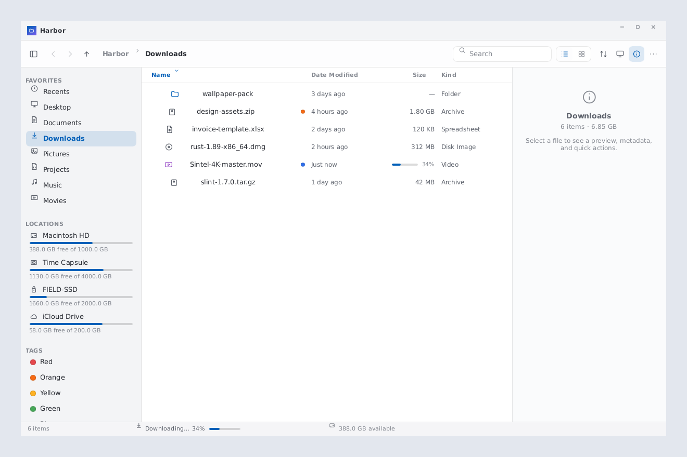
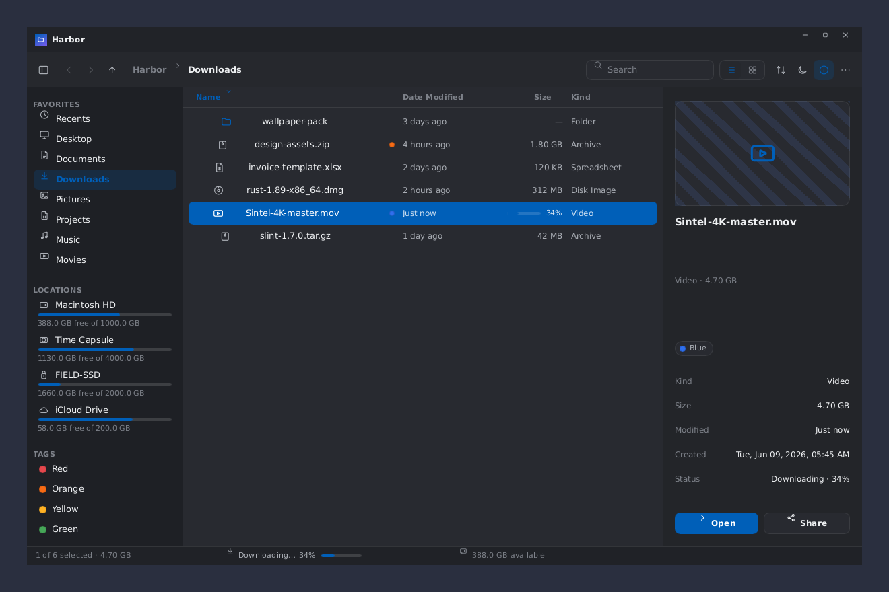
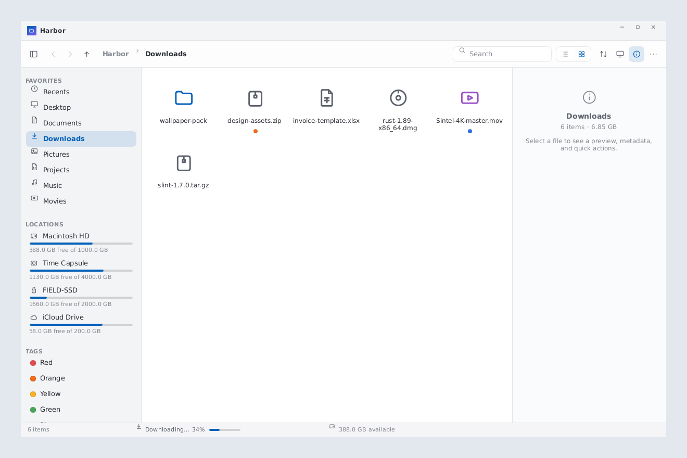
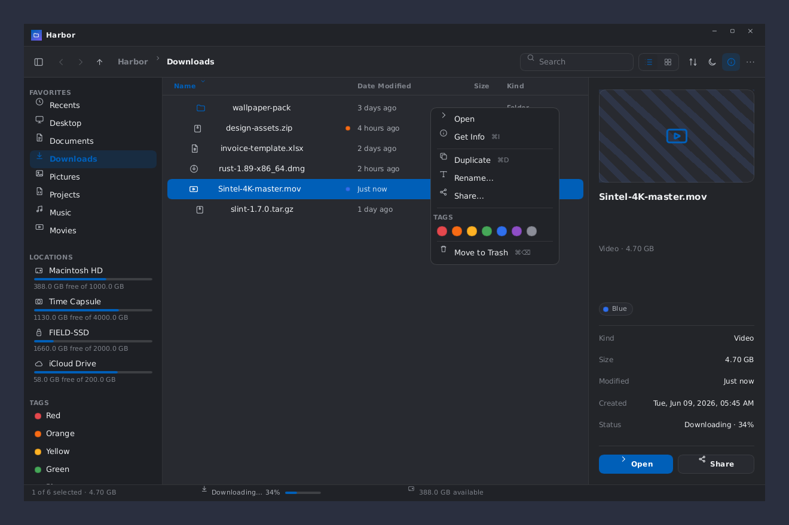

# Harbor

A cross-platform desktop **file-manager UI** built in **Rust + [Slint]**, recreated
from a Claude Design handoff (`Harbor/index.html`). It exercises a broad set of
desktop-UI patterns: data tables, a sidebar with live drive meters, sortable
columns, OS-following light/dark theming, an inspector/details panel, context
menus, and live-updating data (an in-progress download, drifting disk usage).

## Screenshots

**List view, light theme** — OS-following theme, sortable columns, file-type icons,
tag dots, drive meters in the sidebar, and an inline download progressing in a row.



**Details panel, dark theme** — selecting a file shows a preview (striped for media),
metadata grid, tag chips, and Open/Share actions; the accent follows the OS palette.



**Grid view** — `repeat(auto-fill)`-style wrapping cells with thumbnails, clamped
names, and tag dots.



**Right-click context menu** — Open / Get Info / Duplicate / Rename / Share, a row
of tag swatches, and a danger-styled Move to Trash.



## Running

```sh
cargo run
```

Uses **Slint 1.17 from the `master` branch** (git dependency in `Cargo.toml`,
since 1.17 is unreleased). The first build compiles Slint from source and takes a
while.

## Features

- **Theming** — System / Light / Dark, following the OS color scheme via Slint's
  `Palette`, with an in-app override (appearance menu / toolbar icon). All design
  tokens live in `ui/theme.slint`.
- **Navigation** — double-click folders, back/forward history, enclosing-folder,
  breadcrumb, plus Recents and Tag filters in the sidebar.
- **Selection** — single / ⌘·Ctrl-toggle / Shift-range, ⌘/Ctrl+A, Esc to clear,
  ↑/↓ to move, Enter to open, ⌘/Ctrl+⌫ to trash.
- **Views** — list (sortable columns, folders-first) and grid.
- **Search** — filters the current location; shows an empty state.
- **Details panel** — preview (striped placeholder for media), metadata grid, tag
  chips, and actions; adapts to none / one / many selected.
- **Menus** — sort, appearance, overflow, and a right-click context menu with tag
  swatches and a danger Trash action.
- **Live data** — the `Sintel-4K-master.mov` download streams progress inline and
  in the status bar (click for the Transfers popover); drive meters drift. These
  timers stand in for real backend signals.

## Structure

| Path | Purpose |
|---|---|
| `src/data.rs` | Mock filesystem tree, drives, kind/tag tables, byte/date formatters (ported from `data.js`). |
| `src/main.rs` | App state (navigation, selection, sort, theme), callback wiring, and the live `slint::Timer`s. Pushes `ModelRc`s into the UI. |
| `ui/theme.slint` | `Theme` global — all color/spacing tokens, light/dark pairs, tag palette. |
| `ui/icons.slint` | Auto-generated geometric line glyphs (see `tools/gen_icons.py`). |
| `ui/widgets.slint` | Reusable `Icon`, `IconButton`, `Meter`, `TagDot`, `MenuItem`, … |
| `ui/globals.slint` | `AppData` (models/state from Rust), `Logic` (callbacks to Rust), `Menus` (UI-only popover state). |
| `ui/{titlebar,toolbar,sidebar,views,panels,main}.slint` | The view components and window shell. |

Rust owns the single source of truth (the tree + all logic) and exposes the
current folder as a flat, already-sorted `ModelRc<FileRow>`; Slint renders and
forwards interactions back through the `Logic` global.

## Regenerating icons

```sh
python3 tools/gen_icons.py   # rewrites ui/icons.slint
```

## Inspecting / screenshotting (embedded Slint MCP)

Slint ≥ 1.17 ships an embedded MCP server for runtime inspection — screenshots,
clicking elements, typing, and walking the UI tree. Build with the `slint/mcp`
feature and run with debug info enabled:

```sh
SLINT_EMIT_DEBUG_INFO=1 SLINT_MCP_PORT=9315 cargo run --features slint/mcp
```

Then connect to `http://localhost:9315/mcp` (Streamable HTTP / JSON-RPC). On a
headless machine, wrap the run in `xvfb-run -a -s "-screen 0 1360x900x24"` and use
`SLINT_BACKEND=winit-software`. A ready-to-use `.mcp.json` registers this endpoint
for Claude Code, and the Slint skill lives in `.claude/skills/slint/`.

[Slint]: https://slint.dev
